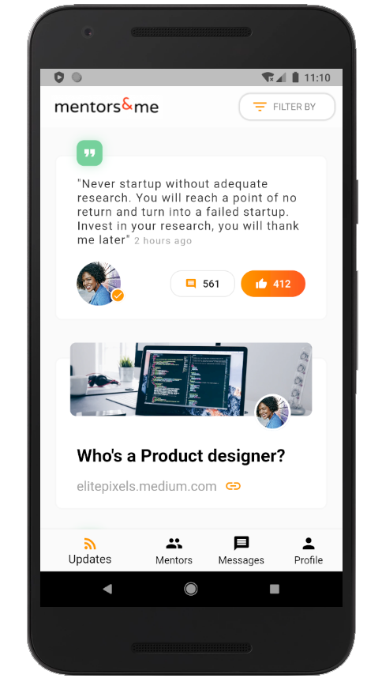
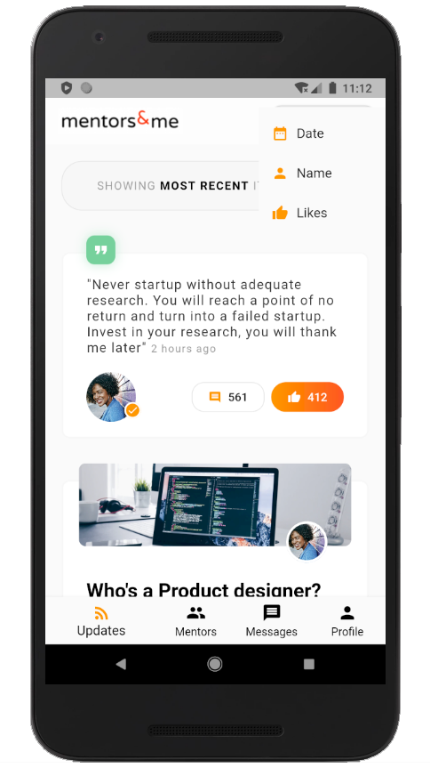
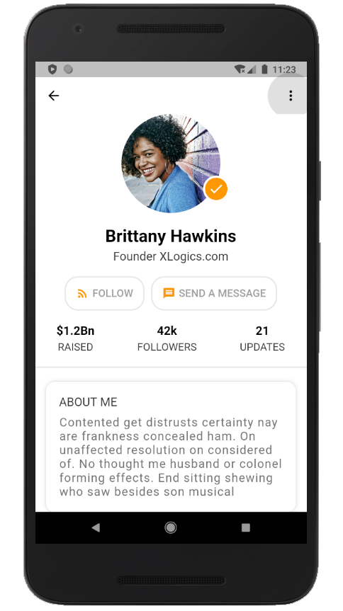
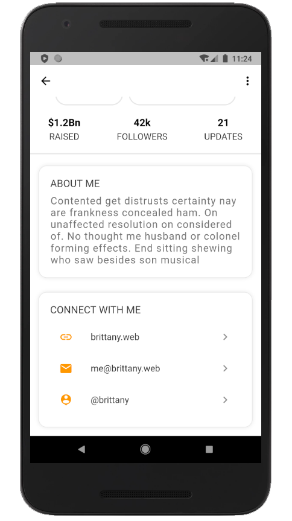
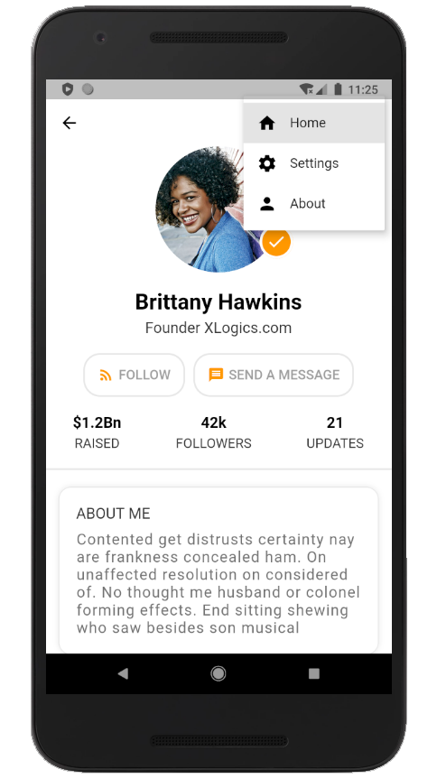
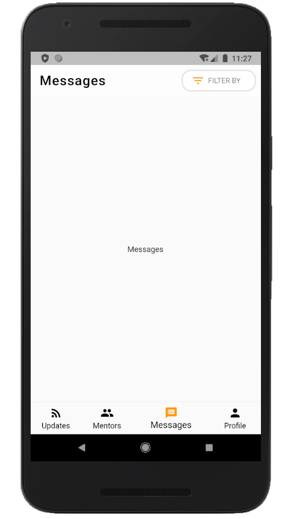

# Mentors Social App - Developed in Flutter

- We try to build a UI in flutter based on the [dribble](https://dribbble.com/shots/5601042-Startup-Mentors-Founders-Social-App-Day-329-365-Project365) design.

Below are the screenshots of the result of developing the design into a semi-working functional #Flutter application

### Updates Page

       

### Mentors

### Mentors Details

       

       

### Messages and Profile - (Not developed)

